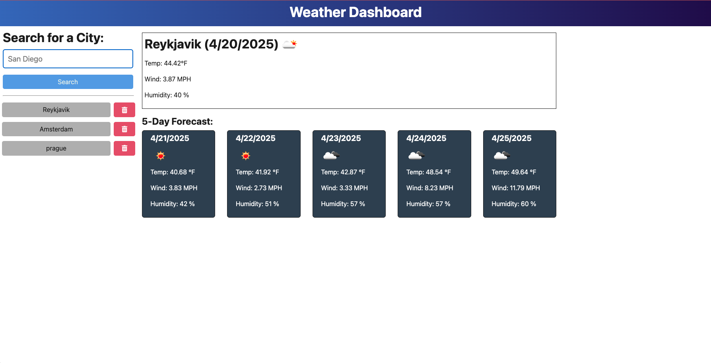

# WeatherDashboard

## Description

This application uses the Open Weather APi to create a dynamic weather application in a browser.
## Table of Contents

1. [Installation](#installation)
2. [Usage](#usage)
3. [Contributing](#contributing)
4. [Tests](#tests)
5. [License](#license)
6. [Questions](#questions)

## Installation

Run the application locally by doing the following in your terminal:

1. Clone the repository to your local computer.  
    `https://github.com/tlesner/Challenge9-WeatherDashboard`
2. Check that node.js is installed.  
   `node -v`
3. Install dependencies.  
   `npm i`

## Usage
To run the application, use the following command in your terminal:  
`npm run start:dev`

You can also explore the final project and link [here](https://weatherdashboard-1-lepn.onrender.com/)

## Contributing

This application was developed by Thomas Lesner. Here are some guidelines on ways to contribute:

# Report a bug fix.

1. Create a new Issue in the GitHub repository.

# Make local changes to push up.

1. Create a new branch (`git checkout -b <your-feature-branch-name>`)
2. Make your changes locally
3. Push the code back to the GitHub repo (`git push origin <your-feature-branch-name>`)
4. Create a pull request to merge your changes

## Tests

The application is working correctly if you are able to search for a city and it shows the 5 day forecast for the city.

## License

The application is covered under [MIT License](https://mit-license.org/#:~:text=The%20MIT%20License%20(MIT)&text=Permission%20is%20hereby%20granted%2C%20free,OTHER%20DEALINGS%20IN%20THE%20SOFTWARE.).  

## Questions

-   GitHub username: [tlesner](https://github.com/tlesner).
-   Reach me at [tjlesner@gmail.com](tjlesner@gmail.com)